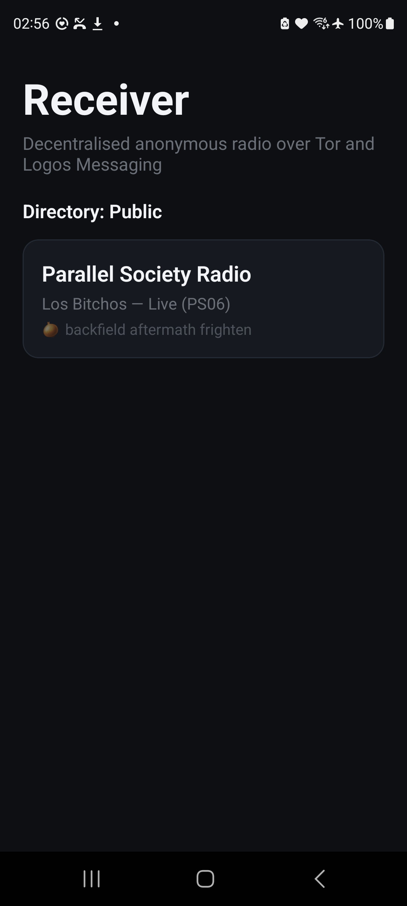

# Receiver (Android)

**Decentralised, anonymous radio — on your phone.** Receiver discovers live radio stations over
**Logos Messaging** (a peer-to-peer messaging network) and plays them through **Tor**, so the station's
location and yours both stay private. Every station is cryptographically signed; forgeries are dropped.

<p align="center">
  
</p>

> The phone runs **its own Logos Messaging node** — it joins the network and receives the station directory
> peer-to-peer. No server, no bridge, no account.

## What it does

- 📡 **Discovers stations** by running an embedded **Logos Messaging** node on the phone (cluster 2, relay) and receiving signed station announces straight from the network.
- 🔑 **Verifies identity** — each announce is signed with secp256k1; the app verifies it on-device and **drops forgeries**. Verified stations carry a PGP-word fingerprint.
- 🧅 **Plays over Tor** — station audio (HLS) streams through an embedded Tor client via `.onion`, hiding your IP and the station's.
- ▶️ **Tap to listen** — a station opens a bottom player that loads over Tor (breathing indicator), then plays.

## How it works

Receiver embeds `liblogosdelivery` — the Logos Messaging node (a Nim library) — through a JNI bridge, joins
Logos Messaging **cluster 2** over relay, and subscribes to the station directory topic. Incoming announces
are decoded, their secp256k1 signatures verified on-device, and verified stations listed. Playback routes
the station's onion HLS through **Tor** (kmp-tor) via an OkHttp data source.

```
Logos Messaging node (cluster 2, relay) ─▶ directory announces ─▶ verify secp256k1 ─▶ station list
                                                                                          │ tap
                                                       onion HLS  ◀──  Tor  ◀─────────────┘ play
```

## Install

Grab the signed APK from [**Releases**](../../releases) and sideload:

```bash
adb install receiver-android-v1.0.apk
```

- **arm64-v8a**, Android 13+. Debug-signed → sideload only (not Play Store).

## Build

```bash
npm install
npx react-native run-android              # debug (Metro)
cd android && ./gradlew assembleRelease   # standalone release APK
```

The Logos Messaging node (`liblogosdelivery.so`) is prebuilt and vendored in
`android/app/src/main/jniLibs/arm64-v8a/`. To rebuild it from source — and for the full build story (the
first Logos Messaging node compiled for Android) — see
[`docs/logos-messaging-android-build.md`](docs/logos-messaging-android-build.md).

## Status

Discovery, identity verification, and Tor playback all work on-device — the phone receives real station
announces peer-to-peer and plays them over Tor with no external node. Open items are tracked in
[Issues](../../issues).

## Companion

[**Booth**](https://github.com/xAlisher/booth-android) — the broadcasting side: create a station and go on
air from your phone (mic → HLS → Tor onion → signed announce).

---

Part of the [Logos](https://logos.co/) ecosystem.
